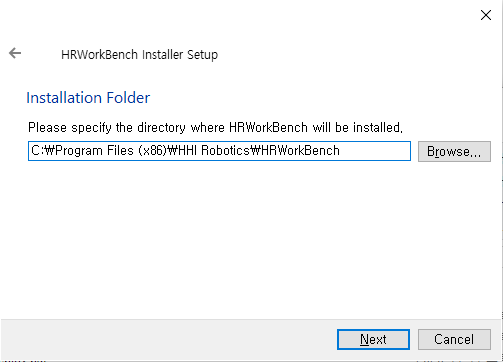
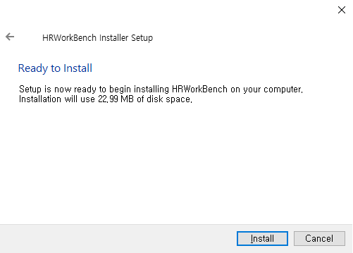
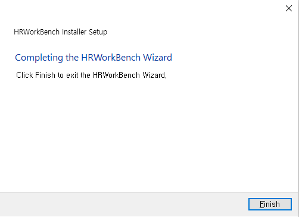

## 1.2 HRWorkBench의 설치와 실행

설치파일을 실행하십시오.

Next 버튼을 계속 누르면, 설치할 위치 등 선택화면이 진행됩니다. 라이선스에 동의하고 마지막으로 Install 버튼을 클릭하면 설치가 진행됩니다.

설치가 완료되면 Finish 버튼을 클릭해, Installer를 종료하십시오.

윈도우 시작버튼을 클릭하고 최근에 추가한 앱, 혹은 HHI Robotics 그룹에서 HRWorkBench를 선택하면 응용프로그램이 실행됩니다.

