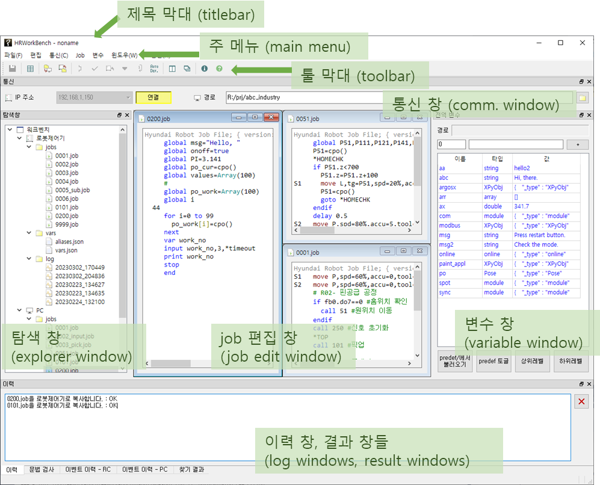
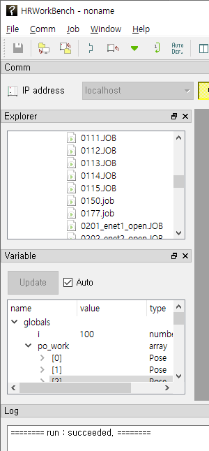
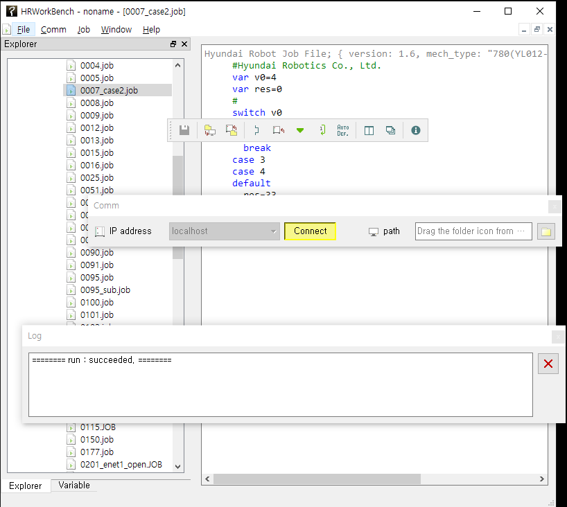
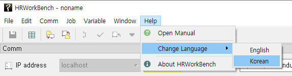

## 1.3 Configuration of the User Interface for HRWorkBench

The figure below shows the names of the user interface elements of the HRWorkBench.
Each function will be described in the order according to the operation sequence.

The elements of the user interface can be rearranged into a layout convenient for the work.
Dragging the toolbar's left edge or dragging the title bar of each window will allow you to detach the toolbar or a window while it is in docking state or attach it back into the docking state. When in the docking state, the windows can be arranged side by side, or they can be stacked into a page from which you can select one using a tab.

  
  

You can change the user interface language by selecting 'Help - Change Language'. After select the language, restart the HRWorkBench application.

