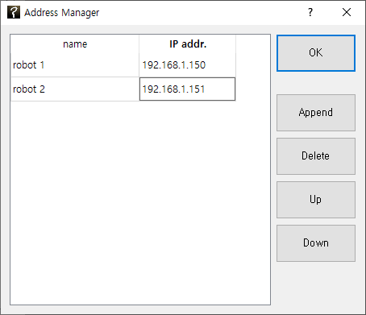
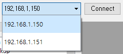
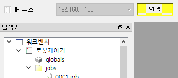
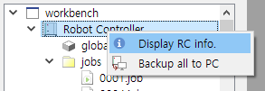
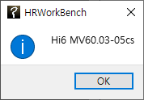

# 2.1 Connect to Ethernet

HRWorkBench and the Hi6/Hi7 robot controller should be connected to the same Ethernet network.
Suppose there are two Hi6/Hi7 controllers that need to be connected, and let us assume that their individual IP addresses are 192.168.1.150 and 192.168.1.151. Moreover, the IP address of the PC is 192.168.1.100. (The devices connected to each other through a hub should all be in the same subnetwork, 192.168.1.XXX.)

The IP Address Manager dialog box will be opened, as shown below, when you select `Comm - Address Manager` in the main menu of HRWorkBench or click the tool   button.
A new input line will be added each time you click the `Append` button. After adding two lines, you need to input the name and IP address, as shown in the figure below.
You can also adjust the order of the current lines by moving them up and down using the `Up` and `Down` buttons.

Now, when you open the IP address combo box in the Comm. window, you can select the two IP addresses that are already inputted.

  
  

When you press the `Connect` button, and the button turns yellow, you are now connected.
If you are successfully connected, the Robot Controller node will appear in the Explore window on the left. Right-click the node and then click Display RC Info. in the pop-up menu. The software version of the Hi6/Hi7 controller will be received and displayed, as shown below.

  
  

