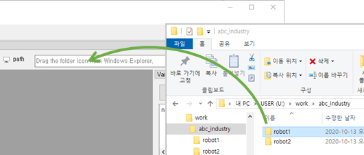
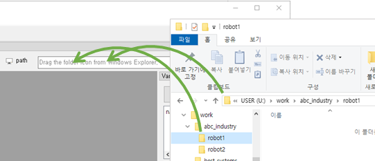
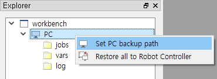
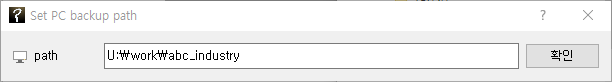
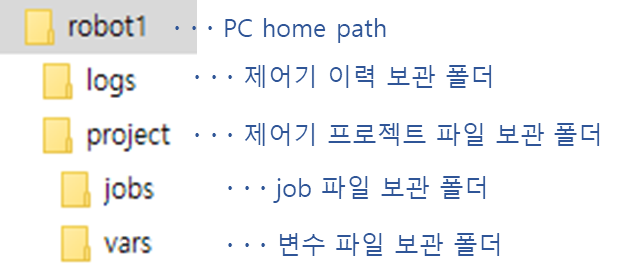
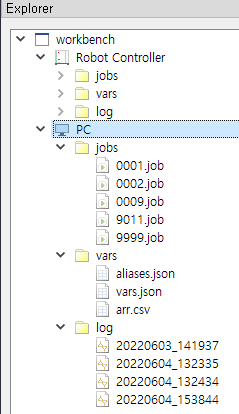

# 2.2 PC경로 선택

로봇제어기의 파일을 백업하거나 편집할 때 PC로 복사해야 하므로, PC측 폴더의 경로를 지정해야 합니다. 이 경로를 현재 PC 홈 경로(current PC home path), 혹은 줄여서 `PC경로(PC path)`라고 합니다. PC경로는 아래의 방법으로 지정할 수 있습니다.

### 방법1

윈도우 탐색기에서 폴더의 아이콘을 마우스 왼쪽 버튼으로 드래그(drag)하여 통신창 위에 드롭(drop)하십시오.

통신창에 지정한 PC경로가 표시됩니다. 이제 PC로 복사한 파일들은 이 폴더에 저장될 것입니다.
 

여러 로봇제어기에 대해 각기 다른 PC 폴더로 관리할 경우에는 이와 같은 드래그 & 드롭 방법으로 폴더를 바꿔가면서 작업하십시오.
표시된 경로 우측의  버튼을 클릭하면, 해당 경로가 윈도우 탐색기로 열립니다.

### 방법2

우측의  버튼을 클릭하면 폴더 선택 대화상자가 열립니다. 폴더를 선택한 후, `[폴더 선택]` 버튼을 클릭하면 경로가 입력됩니다.

### 방법3

탐색창의 PC 노드에 마우스 우클릭하여 팝업 메뉴를 열고 `PC 백업 경로 설정`을 선택하면, 대화상자가 열립니다. 대화상자에 경로를 타이핑 혹은 윈도우 탐색기의 경로를 복사/붙여넣기 한 후 `확인` 버튼을 클릭하십시오.

PC경로의 폴더 구조는 아래 그림과 같이 구성됩니다.
만일 PC 경로에 전에 백업해둔 job들이 있다면 탐색창의 PC 노드에 그림과 같이 표시됩니다.

  
  

