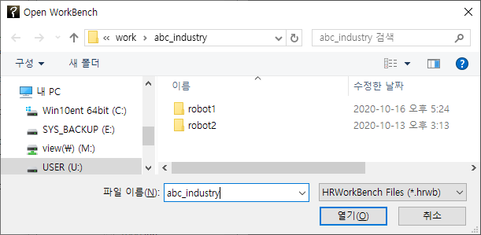
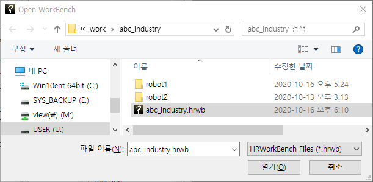
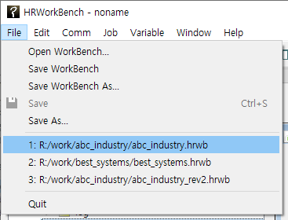
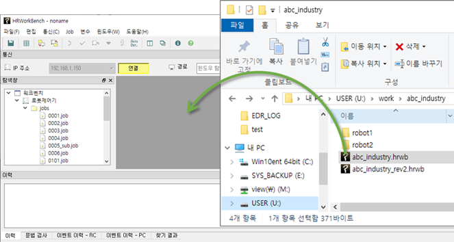

# 2.3 Workbench 파일의 저장과 불러오기

설정해놓은 작업환경을 확장자 `.hrwb`인 workbench 파일로 저장하고, 불러올 수 있습니다.
아래와 같은 항목들이 저장됩니다.

*	IP 주소 관리자에 작성된 목록
*	PC 경로 설정

workbench를 저장해보겠습니다. 기본설정을 한 후, 주 메뉴에서 `파일 – WorkBench 저장`를 선택하십시오. 원하는 경로를 선택하고 파일명을 입력한 후 저장 버튼을 클릭하십시오.

Workbench 파일의 불러오기를 해 보겠습니다. HRWorkBench를 종료한 후 다시 실행한 다음, 주 메뉴에서 `파일 – WorkBench 열기`를 선택하십시오. 저장했던 파일을 선택하면, 기존의 설정들이 복원되는 것을 확인할 수 있습니다.

최근 불러오기 한 경로파일명들은 주 메뉴의 File에 열거되므로, 이를 클릭하여 신속하게 파일을 열 수도 있습니다.

혹은 윈도우 탐색기에서 .hrwb 파일의 아이콘을 드래그 & 드롭하여 열 수도 있습니다.

