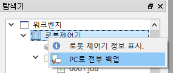
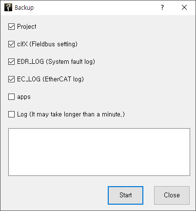
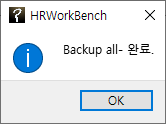
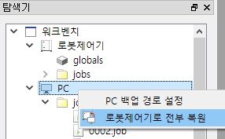
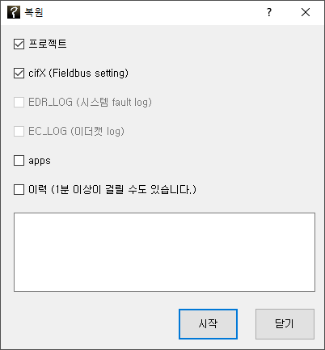

# 3.1 백업과 복원

${cont_model} 제어기의 파일들을 백업하거나 복원할 수 있습니다.
먼저 연결 버튼을 눌러, 제어기에 원격 접속하십시오. 탐색창에서 '로봇제어기' 노드에 마우스 우버튼으로 팝업 메뉴를 열어 'PC로 전부 백업'을 선택하면, 백업 대화상자가 나타납니다.

  
  

백업할 대상을 체크한 후 `[시작]` 버튼을 누르면 제어기 내의 파일들이 PC 경로로 백업됩니다. 백업이 완료되면 완료 대화상자가 표시되며, 탐색창의 PC 노드의 파일 목록이 갱신됩니다.
 

복원방법도 이와 유사합니다.
탐색창에서 'PC' 노드에 마우스 우버튼으로 팝업 메뉴를 열어 '로봇제어기로 전부 복원'을 선택하면, 복원 대화상자가 나타납니다.

  
  

복원할 대상을 체크한 후 `[시작]` 버튼을 누르면 PC 경로의 파일들이 로봇제어기로 복원되고, 완료 대화상자가 표시됩니다.


복원을 수행할 때는 ${cont_model} 제어기는 모터off 상태여야 합니다. 모터on 상태에서 수행하면 불가 메시지가 출력됩니다.

