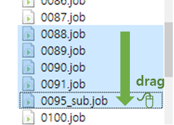
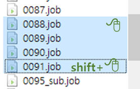
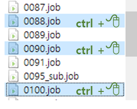
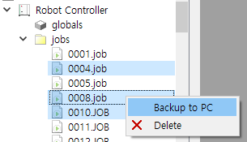
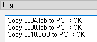
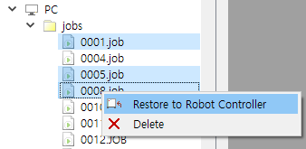
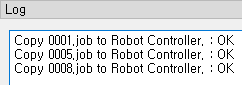
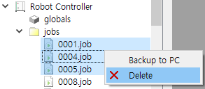

# 3.2 Copy and Delete Job Files

You can only copy some of the controller's job files.
When copying job files from the robot controller to the PC, click and select the targeted job files under the `Robot Controller/jobs/` path in the Explore window.
To select multiple files, you use the following methods.

<table>
<tr>
  <td></td>
  <td>Drag and select multiple files while pressing the left button.</td>
</tr>
<tr>
  <td></td>
  <td>Select one file, hold the Shift key, then click another file to select files in between.</td>
</tr>
<tr>
  <td></td>
  <td>Select multiple files individually while pressing the ctrl key.</td>
</tr>
</table>

Right-click the selected job files and then select `Backup to PC` in the pop-up menu. The copy result will be displayed in the Log window, and the names of copied files will be displayed on the `PC/jobs` node.

  
  

The method is similar when copying files from the PC to the robot controller.
Click and select the desired job files under the `PC/jobs/` path in the Explore window.
Right-click the selected job files and select `Restore to Robot Controller` in the pop-up menu.

  
  

 

You can delete job files in the robot controller or the job files in the PC using the `Delete` pop-up menu.

