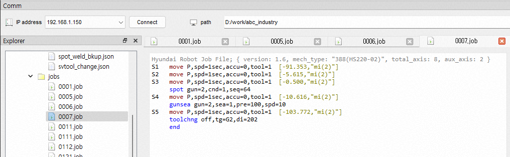
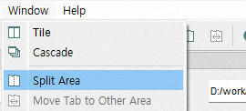
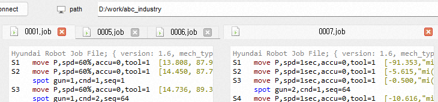
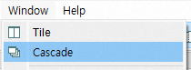
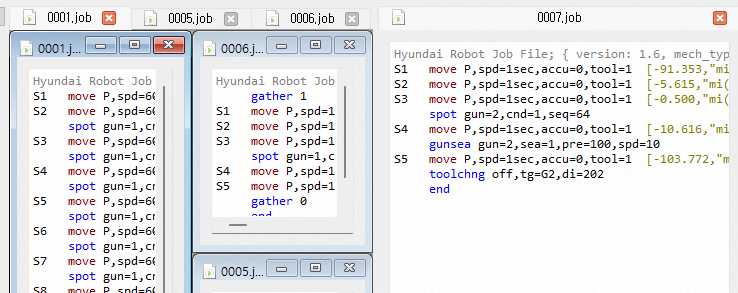

# 4.1.1 Open and Arrange Edit Windows

Double-click the desired PC-side job file in the Explore pane to open the editor. Let's open four job files in sequence: 0001.job, 0005.job, 0006.job, and 0007.job. As shown below, the editor window for the last opened file, 0007.job, fills the area, with the file names displayed on the tabs.
 

You can select a tab to edit the desired job. To compare two files, you can split the area into up to two panes using the `Window - Split Area` menu or tool button. Clicking it once more will merge the areas back together.
  

You can reorder tabs by dragging them with the left mouse button. Alternatively, you can move a tab to another area using the `Window - Move Tab to Other Area` menu or the tool button.
Selecting `Tile` or `Cascade` from the `Window` main menu or the toolbar allows you to arrange multiple job editor windows side by side within an area.

You can minimize the Edit window with the  button and maximize it with the  button. Clicking the  button or pressing `ctrl+F4` will close the Edit window.
