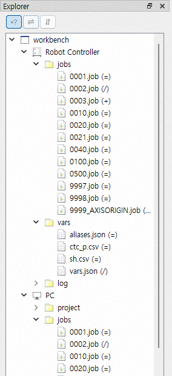
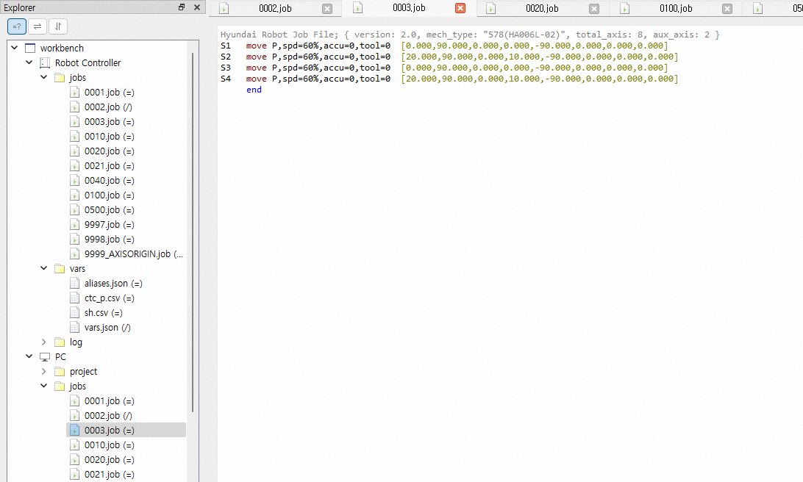
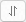

# 4.1.2 File Comparison and Sync. Selection

### File Comparison

Click the `Compare RC/PC` () button above the Explorer pane to display whether the items in `jobs/` and `vars/` are identical between the Robot Controller and the PC.

 
The symbols displayed to the right of each item have the following meanings:

| Symbol |   Description                          |
|------|------------------------------------------|
|  =  | The file contents are identical.           |
|  /  | The file contents are different.           |
|  +  | The file does not exist on the other side. |

This button works as a toggle. Click it again to hide the comparison results.

---------------------
### Sync. Selection

When there are many job and variable files, finding a specific file in the tree view can be cumbersome. The `Sync. Selection` buttons you to quickly select the corresponding file.

With a tab selected in one of the job editors, click the `Tree/Tab Sync.` () button. The corresponding job item under `PC/jobs/` is selected. (If an item under `Robot Controller/jobs/` was selected, the corresponding item under `Robot Controller/jobs/` is selected.)

When an item under `Robot Controller/jobs/` is selected, click the `RC/PC Sync.` () button to move the selection to the corresponding item under `PC/jobs/`. If an item under `PC/jobs/` is selected, the selection moves in the opposite direction. In other words, each click of the button switches the selection between the RC and PC.

(The same behavior applies to `vars/`.)
