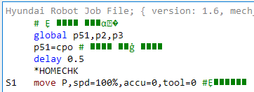
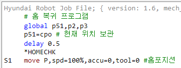

# 4.1.2 인코딩 변환하여 다시 불러오기

job 파일을 열었을 때, 영어가 아닌 글자(한글, 중문 등) 주석이나 문자열이 깨져 보이는 경우가있습니다. ${cont_model}제어기의 job파일은 utf-8 인코딩으로 저장되어야 하는데, 다른 인코딩(가령, EUC-KR이나 GB2312)으로 저장되어 있으면 HRWorkBench와 티치펜던트에 제대로 표시되지 않습니다.

 

가령 job 파일이 확장완성형으로 되어 있다면 주 메뉴의 `Job – 인코딩 : 다른 언어로 다시 불러오기 – 한국어(ko-KR)`을 선택하십시오. job 파일이 utf-8로 변환되어 편집 창에 열리므로 글자가 제대로 표시될 것입니다. 이 상태에서 저장하면 utf-8 인코딩 파일로 저장됩니다.
(영어만으로 작성된 파일의 경우, ascii 파일과 utf-8파일은 동일하므로, 이러한 조작이 필요없습니다.)

 
