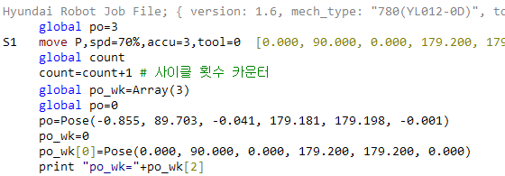
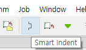
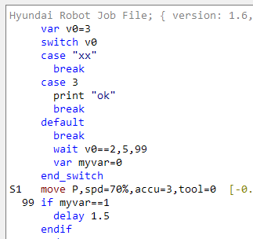

# 4.1.3 Syntax Coloring and Automatic Multi Stage Indentation (Smart Indent)

The Edit window provides basic syntax coloring for readability, where main commands and strings, hidden poses, comments, and job headers are displayed in unique colors.

An automatic multi stage indentation function (smart indent) is also used for a more easy-to-read structure of the flow control statement. All of the current job programs in the Edit window will be automatically indented if you click `Smart Indent` under the Job main menu or toolbar.

  
  

