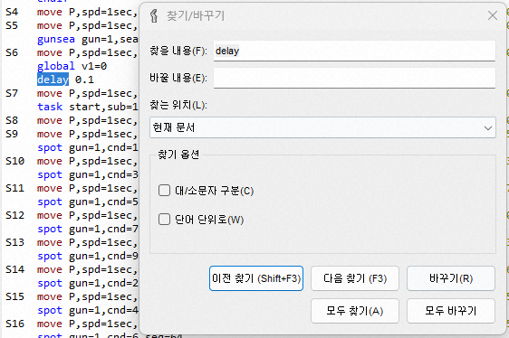
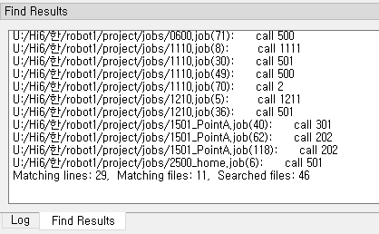
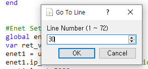

# 4.1.5 찾기/바꾸기/찾아가기

주 메뉴의 '편집 - 찾기와 바꾸기'를 선택하거나 단축키 Ctrl+F 혹은 Ctrl+F3을 눌러 찾기/바꾸기 대화상자를 열 수 있습니다. 특정한 텍스트를 선택한 상태였으면, 그 텍스트가 자동으로 '찾을 내용'에 입력됩니다. 
 

대화상자의 각 옵션의 기능은 아래와 같습니다.

<table>
<tr>
  <th>이름</th>
  <th colspan=2>기능</th>
</tr>
<tr>
  <td rowspan=2>찾는 위치</td>
  <td>현재 문서</td>
  <td>현재 선택한 job 편집창 내에서만 수행.</td>
</tr>
<tr>
  <td>현재 프로젝트</td>
  <td>프로젝트의 PC 노드 아래의 모든 job에 대해 수행.</td>
</tr>
<tr>
  <td>대/소문자 구분</td>
  <td colspan=2>선택하면 대소문자를 구분</td>
</tr>
<tr>
  <td>단어 단위로</td>
  <td colspan=2>선택하면 완전한 단어에 대해서만 검색</td>
</tr>
</table>

`[이전 찾기]` 혹은 `[다음 찾기]` 버튼을 클릭하면 이전 혹은 다음 일치하는 문자열로 커서 선택이 이동합니다. `[바꾸기]` 버튼을 누르면 현재 선택된 문자열을 '바꿀 내용:'에 입력된 문자열로 교체한 후, 다음 일치하는 문자열로 이동합니다.
`[모두 찾기]` 버튼을 클릭하면, `찾는 위치`에 지정한 범위 전체를 대상으로 검색하여, 하단의 `찾기 결과` 창에 검색된 항목들을 경로파일명(행번호): 문자열의 형식으로 열거해줍니다. 특정한 항목에 대해 더블클릭하면, 해당하는 파일이 열리면서, 일치한 위치로 커서가 이동합니다.
(`찾기/바꾸기` 대화상자를 닫은 상태에서도, `Shift+F3 (이전 찾기)`과 `F3 (다음 찾기)` 단축키를 사용할 수 있습니다.)

`[모두 바꾸기]` 버튼을 클릭하면, `[찾는 위치]`에 지정한 범위 전체를 대상으로 검색하여, 일치한 문자열을 `바꿀 내용:`에 입력된 문자열로 교체하면서, 하단의 `찾기 결과` 창에 검색된 항목들을 열거해줍니다.

주 메뉴의 `Job - 줄 이동`을 선택하거나 단축키 `Ctrl+G`를 눌러 찾아가기 대화상자를 열 수 있습니다. 행 번호를 입력하면 해당 행 번호로 커서가 이동합니다.

