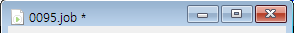
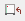

# 4.1.5 Undo/Redo와 저장

편집 창은 단축키로 `Ctrl+Z`와 `Ctrl+Y`로 Undo와 Redo를 제공합니다.

제목 tab 혹은 제목 막대의 파일명에 아래와 같이 `*` 표시가 있으면 편집 후 아직 저장되지 않는 내용이 있다는 의미입니다.
주 메뉴의 `파일 - 저장`, 혹은 `파일 - 다른 이름으로 저장`을 선택하여 편집 내용을 파일에 저장할 수 있습니다. 혹은 단축키 `Ctrl+S`를 누르거나 툴 막대의  버튼을 클릭하십시오.

주 메뉴의 'Job - 저장 후 RC로 복사'를 선택하거나 툴 막대의  버튼을 클릭하면, 저장 후 로봇제어기로 복사하여 즉시 반영까지 해줍니다.
