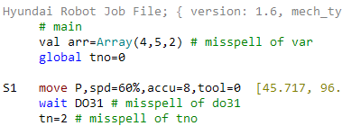
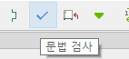
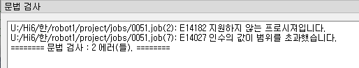

# 4.2 Check the Robot Language Syntax

You can remotely carry out a basic syntax check on the job file currently being edited. 

While the job file to be checked is open, as shown below, click `Syntax Check` on the main menu or on the toolbar.

 

The path file name and line number, where there is a syntax error, and the relevant error message will be displayed on the `Syntax Check` window.

Double-clicking an error will move the cursor to the corresponding position.
 

Because this syntax check is executed without the actual execution of a job, it cannot detect all errors that may occur when a job is executed. In the job file shown in the figure above, it was detected that `var` was incorrectly marked as `val` and that the `move` statement accuracy exceeded the range of 0–7. However, it could not detect that the I/O variable do31 of the `wait` statement was incorrectly marked as `DO31` and that `tno=2` was incorrectly marked as `tn=2.` They are not considered errors because the variables `DO31` and `tn` may possibly have been created during execution.
