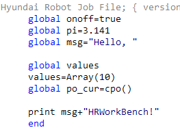
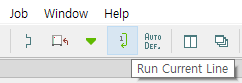
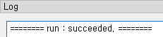
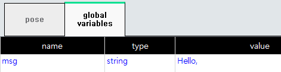
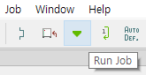
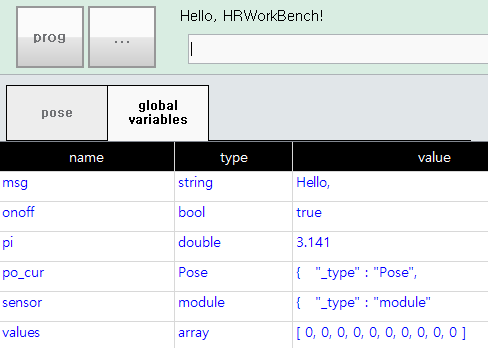

# 4.3 Execute Robot Language Statements

You can remotely execute robot language statements in job files. A move statement or flow control statement is not supported. It only supports some commands can be executed individually, such as assignment statements.

The global variables window in the teach pendant of the connected ${cont_model} controller should be left open to check the result.

The following program was created as a demonstration in the Job Edit window.

Place the cursor on global msg="Hello," and click on Job in the main menu, or `Run Current Line` in the toolbar.
 

A success message will be displayed in the Log window if the remote execution is successful. In the global variables of the teach pendant, you can also see that the `msg` variable has been created.
     

 
Clicking on `Job` in the main menu or `Run Job` in the toolbar will execute all of the currently selected jobs, including the `print` statement.

