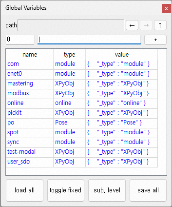
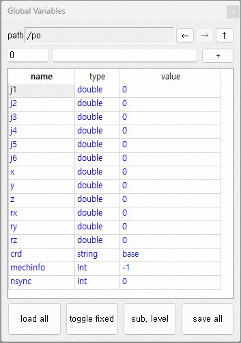
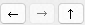

# 4.4 Monitor Global Variables and Set Their Values

When the connect button is pressed online, the Global Variables window displays the current global variable values. The functionality of the Global Variables window is almost identical to that of the ${cont_model} Teach Pendant (TP630). 

See the link below for instructions.

https://hrbook-hrc.web.app/#/view/doc-hi6-operation/en-tp630/6-monitoring/3-job/3-global-variable/README?cont_model=Hi7

*	The common things: Finding variables, changing variable type/name/value, creating/deleting variables, creating arrays, checking/changing array element values, and checking/changing object property values are all the same.

*	The differences: The properties window for Pose/Shift values is not supported, and expands the same as any other object type.

*	Use the  buttons to navigate back, forward, or up to the parent folder.
