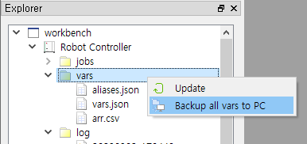
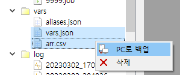
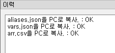
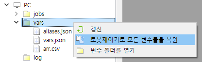
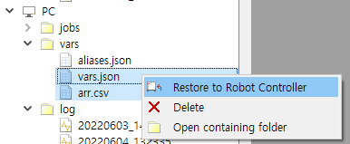
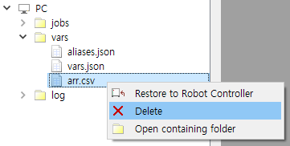
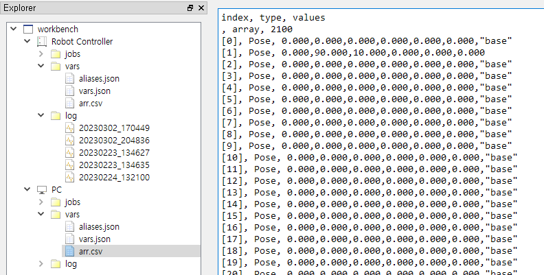

# 4.5 Copying and deleting global variable files


The global variable export function prior to v1.4.2 is superseded by this function.


The Variables window allows you to monitor global variables and set values, but has limitations in editing large lists of variables.
Global variables are stored in `var.json` files within the Hi6/Hi7 controller, of which predefined-variables are stored in `.csv` files. These are all text files, so you can easily edit them if you copy them to your PC.

The method of backing up and restoring variable files is similar to job files. Select the `vars/` folder of the robot controller, or some files, and then right-click to open the pop-up menu. When the `Backup to PC` menu is selected, the Log panel displays the copy results, and the copied file names are displayed in the `PC/vars` node.

Next, let's copy from the PC to the robot controller. The methods are similar.

Click to select the desired variable files under `PC/vars/` path in the Explorer panel.
Click the right button on the selected variable files and select the `Restore to Robot Controller` pop-up menu.

Variable files on the robot controller or PC can be deleted using the `Delete` pop-up menu. Deleting a variable file on the robot controller also deletes that variable.


When restoring or deleting variables, the Hi6/Hi7 controller must be in the Motor-Off state. When carried out in the Motor-On state, the message is displayed that it is not possible.


Double-click a variable file on your PC to open a text edit window. If you double-click the variable file on the robot controller, once it backs up it to `PC/vars/` and open the file on the PC side.

