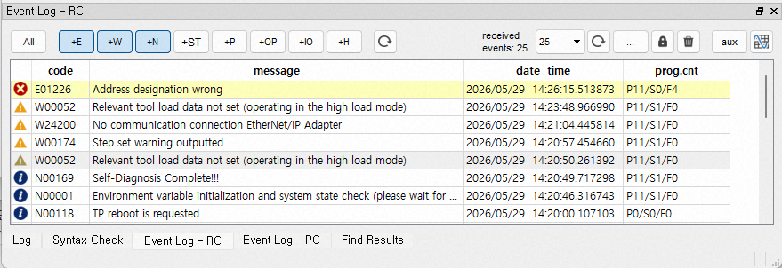
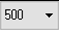
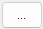
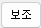

# 5.1.1 이벤트 이력 모니터링 창

하단에 `이벤트 이력 – RC`와 `이벤트 이력 – PC`의 2개의 탭을 볼 수 있습니다.
`이벤트 이력 – RC`는 ${cont_model} 제어기가 이더넷으로 연결된 상태에서 제어기 내의 이벤트 이력과 새로 발생하는 이벤트들을 모니터링하는 창입니다.
`이벤트 이력 – PC`는 PC경로의 `log/` 폴더에 있는 이벤트 이력 파일들을 읽어들여 보여주는 창입니다. (${cont_model} 제어기 V60.05-04 및 이후 버전에서 지원됩니다.)

이 창은 ${cont_model}의 티치펜던트에서 제공하는 U/I와 유사한 기능을 제공합니다. 이벤트 이력들은 발생 시점의 역순으로 표시되며, 새로 발생한 이벤트들은 노란 바탕색으로 표시됩니다.

창의 상단에는 이벤트 타입 필터 버튼들이 있으며, 눌려있는 타입의 이벤트만 표시됩니다. 가령 위 그림에서는 에러(E)와 경고(W), 알림(N) 타입만 표시되고 있습니다. (필터 버튼 조작 후엔 필터 우측의 업데이트 버튼()을 클릭해야 화면이 갱신됩니다.)

<table>
<tr>
  <th>분류</th>
  <th>U/I</th>
  <th>설명</th>
</tr>
<tr>
	<td rowspan=9>필터</td>
  <td>전부</td>
  <td>모든 이력 종류 켜기 혹은 끄기 (토글)</td>
</tr>
<tr>
  <td>E (Error)</td>
  <td>에러 이력 표시</td>
</tr>
<tr>
  <td>W (Warning)</td>
  <td>경고 이력 표시</td>
</tr>
<tr>
  <td>N (Notice)</td>
  <td>알림 이력 표시</td>
</tr>
<tr>
  <td>ST (Start/Stop)</td>
  <td>기동/정지 이력 표시</td>
</tr>
<tr>
  <td>P (Periodic)</td>
  <td>주기적 상태 이력 표시</td>
</tr>
<tr>
  <td>OP (Operation)</td>
  <td>조작 이력 표시</td>
</tr>
<tr>
  <td>IO (I/O)</td>
  <td>I/O 이력 표시</td>
</tr>
<tr>
  <td>H (History)</td>
  <td>실행 이력 표시</td>
</tr>
<tr>
  <td>업데이트</td>
  <td></td>
  <td>선택된 필터 적용</td>
</tr>
<tr>
  <td></td>
  <td></td>
  <td>창에 몇 개의 이력을 표시할 지 선택한 후, 화면 갱신</td>
</tr>
<tr>
  <td>다시 로드 후 업데이트</td>
  <td></td>
  <td>제어기 혹은, 파일로부터 이력을 다시 읽어 테이블에 표시.</td>
</tr>
<tr>
  <td rowspan=2> (팝업 메뉴)</td>
  <td>이력 파일들로 저장</td>
  <td>제어기 메모리에 쌓인 현재까지의 이력들을 제어기의 log 파일로 저장.</td>
</tr>
<tr>
  <td>이력 파일들 클리어</td>
  <td>제어기의 메모리와 log 파일의 이력들을 모두 클리어.</td>
</tr>
<tr>
  <td rowspan=2></td>
  <td></td>
  <td>새로운 이력 모니터링을 중단</td>
</tr>
<tr>
  <td></td>
  <td>이력 창의 항목들을 클리어</td>
</tr>
<tr>
  <td rowspan=2></td>
  <td></td>
  <td>이벤트 보조 데이터 창 열기</td>
</tr>
<tr>
  <td></td>
  <td>스코프 열기</td>
</tr>

</table>

