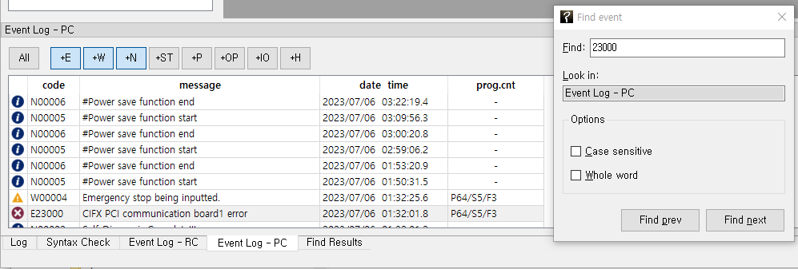

# 5.1.2 이벤트 찾기

이벤트 이력 창에서 `편집 - 찾기와 바꾸기` 메뉴를 선택하거나, `Ctrl+F` 키를 누르면, 이벤트 찾기 대화상자가 열립니다.
`찾을 내용:`에 찾을 코드나 메시지, 날짜 시간, 혹은 프로그램 카운트를 입력하고 `다음 찾기(N)` 혹은 `이전 찾기(P)`를 클릭하면, 현재 선택된 행부터 검색하여 해당 문자열을 포함하는 다음 혹은 이전 행을 선택해줍니다.

 

대화상자의 각 옵션의 기능은 아래와 같습니다.

<table>
<tr>
  <th>이름</th>
  <th>기능</th>
</tr>
<tr>
  <td>찾는 위치</td>
  <td>이벤트 이력-RC와 이벤트 이력-PC 중, 어느 이력창에서 검색을 수행할 지를 표시해줍니다. 클릭하여 선택할 수는 없습니다. 
  (이벤트 이력-RC 창과 이벤트 이력-PC 창의 이벤트 찾기 대화상자는 따로 존재합니다. 해당 이력 창에서 대화상자를 연 후 찾기를 수행하십시오.)
</td>
</tr>
<tr>
  <td>대/소문자 구분</td>
  <td>선택하면 대소문자를 구분</td>
</tr>
<tr>
  <td>단어 단위로</td>
  <td>선택하면 완전한 단어에 대해서만 검색</td>
</tr>
</table>

