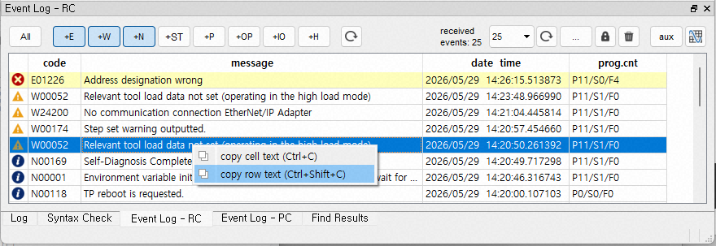

# 5.1.3 Copy event text

Right-clicking the selected event history opens a pop-up menu.

 

*	Copy Cell Text: Copies the text from the selected row and column to the clipboard.
*	Copy Row Text: Copies the text from all columns in the selected row to the clipboard. The text from each column is separated by the `|` character.
