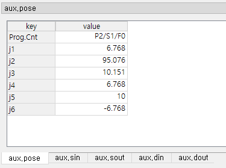
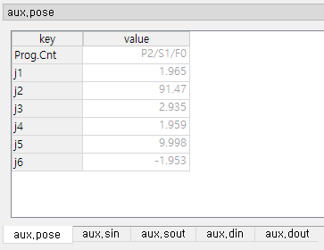

# 5.2.1. Pose Data (aux.pose)

When you click the Error/Warning/Start/Stop event row, the program counter at the time of the event and the value of each axis (mm|deg) are displayed.

Because program counters and pose auxiliary data are recorded only on error and warning events, when you click on rows of different types of events, the data are dimly displayed. This indicates that it is the data of error/warning/start/stop event recorded just before that event, and may not be accurate.

