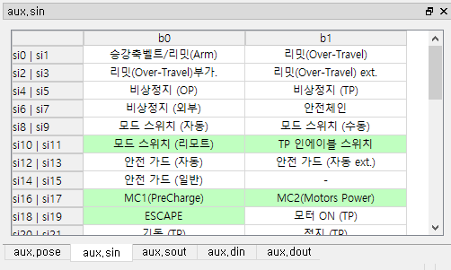

# 5.2.2 시스템 입출력 (aux.sin/sout)

에러/경고/기동/정지 이벤트 행을 클릭하면, 이벤트 발생 시점의 시스템 입력과 출력이 표시됩니다.
시스템 입출력 보조정보는 에러와 경고 이벤트에만 기록되기 때문에, 다른 종류의 이벤트 행을 클릭하면 데이터가 희미하게 표시됩니다. 이는 해당 이벤트 바로 전에 기록된 에러/경고/기동/정지 이벤트의 보조데이터를 그대로 보여주는 것으로서 정확하지 않을 수 있습니다.

