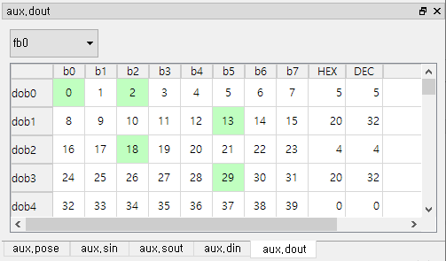
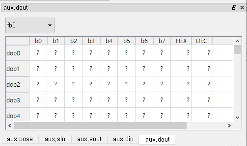

# 5.2.3 General input/output (aux.din/dout)

When you click the Periodic State/IO event row, the general input and output are displayed.

Using the combo box at the top, you can select the signal groups `fb0 to fb9` to be displayed. IO events occur only with the differential information when any `dio` value changes. In addition, the periodic state event occurs with only one `fb` group's full `dio` information per minute in the ${cont_model} controller. HRWorkBench accumulates this information to show all the `dio` information in all `fb` groups in the general input/output window for each event row.

Therefore, if you click on a row of older events where the `dio` information is not accumulated enough, the data is not displayed and but just `?` symbol, as below.

