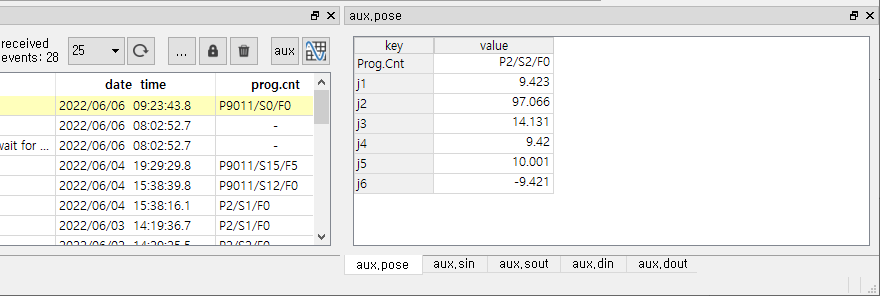

# 5.2 Auxiliary Data

If you click the  button, five event aux. data windows will be open.

 

<table>
<tr>
  <th>panel name</th>
  <th>contents</th>
  <th>supported event type</th>
</tr>
<tr>
  <td>aux.pose</td>
  <td>program counter and pose data</td>
  <td>error/warning/start/stop</td>
</tr>
<tr>
  <td>aux.sin</td>
  <td>system input</td>
  <td>error/warning/start/stop</td>
</tr>
<tr>
  <td>aux.sout</td>
  <td>system output</td>
  <td>error/warning/start/stop</td>
</tr>
<tr>
  <td>aux.din</td>
  <td>general input</td>
  <td>periodic state/IO</td>
</tr>
<tr>
  <td>aux.dout</td>
  <td>general output</td>
  <td>periodic state/IO</td>
</tr>
</table>
