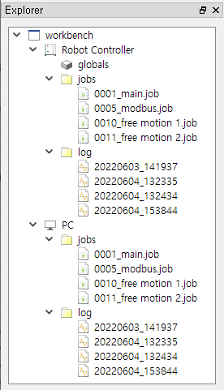

# 5.3.1 스코프 이력이란?

Hi6/Hi7 제어기는 `E160 충돌검지`와 같은 중대 에러나 경고가 발생할 때, 각 축의 위치/속도/가속도/상태코드 등 분석에 필요한 5ms의 샘플링 주기, 30초간의 (발생 전 25초 + 발생 후 5초) 데이터를 파일로 저장하는데 이를 스코프 이력이라고 합니다.
스코프 이력은 제어기의 `log/` 폴더에 .json과 .bin 파일 쌍으로 저장됩니다. (용량이 크기 때문에 일정 개수만 저장되고 이전 데이터는 삭제됩니다.)
원격의 로봇제어기와 PC경로에 저장되어 있는 스코프 이력들은 탐색 창의 `log/` 폴더에 표시되는데, 노드의 이름은 년월일_시분초의 형식의 파일 저장 시점입니다.

