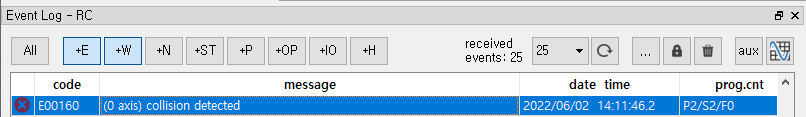
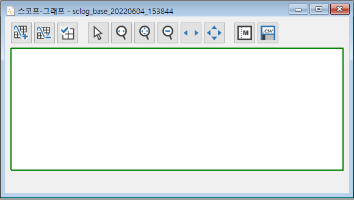
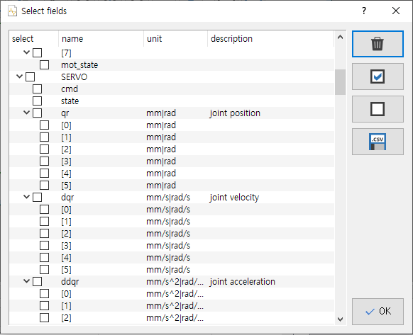
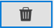
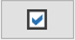
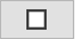
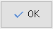
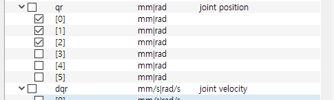
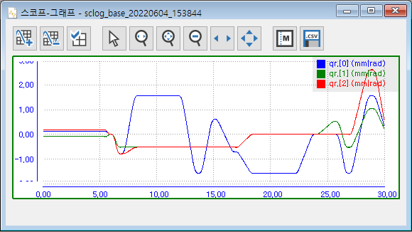

# 5.3.2 스코프 열기

중대 에러나 경고 이벤트 행을 선택하고 우상단의  버튼을 클릭하면 스코프 창이 열립니다.

(해당 이벤트 시점의 스코프 이력 파일이 없으면 열리지 않습니다.)

(탐색 창의 `log/` 폴더의 스코프 이력 항목을 더블클릭해서 열 수도 있습니다.)

좌상단의  버튼을 클릭하면, 필드(항목) 선택 창이 열립니다.

필드 선택 창의 각 항목은 이름과 단위, 설명을 표시하고 있습니다.

<table>
<tr>
  <th>버튼</th>
  <th>기능</th>
  <th>비고</th>
</tr>
<tr>
  <td></td>
  <td>모든 체크를 해제합니다.</td>
  <td></td>
</tr>
<tr>
  <td></td>
  <td>선택한 행들을 한번에 체크합니다. 
		(마우스 좌버튼으로 드래그하거나, Ctrl+좌버튼, 혹은 Shift+좌버튼으로 여러 항목 행을 선택할 수 있습니다.)
	</td>
  <td></td>
</tr>
<tr>
  <td></td>
  <td>선택한 행들을 한번에 체크 해제합니다.</td>
  <td></td>
</tr>
<tr>
  <td></td>
  <td>.csv 파일로 익스포트(export)합니다.</td>
  <td>외부 소프트웨어에서 활용하기 위한 용도입니다.</td>
</tr>
<tr>
  <td></td>
  <td>필드 선택 창을 닫고, 체크된 항목의 그래프를 표시합니다.</td>
  <td></td>
</tr>
</table>

가령 qr[0]~qr[5]는 단위가 mm 혹은 rad이며, 1~6축의 `joint position (축 위치)` 데이터입니다. 

충돌이 발생했을 때의 1축~3축의 데이터를 확인하고자 한다면 qr[0]~qr[2]를 체크한 후 `[확인]` 버튼을 클릭합니다. 

몇 초 후 그래프가 열립니다.

