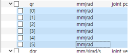
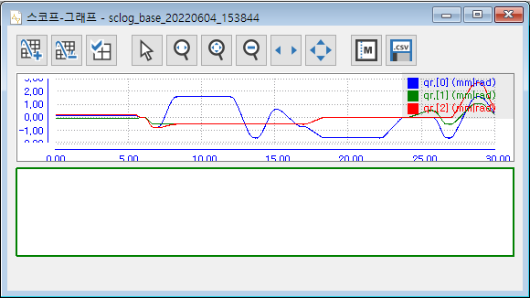
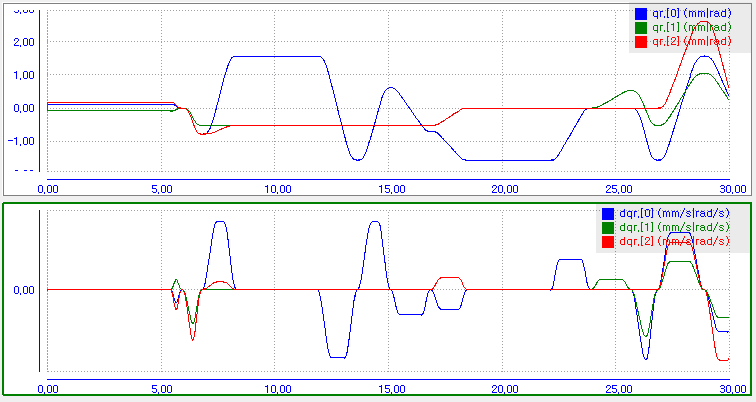
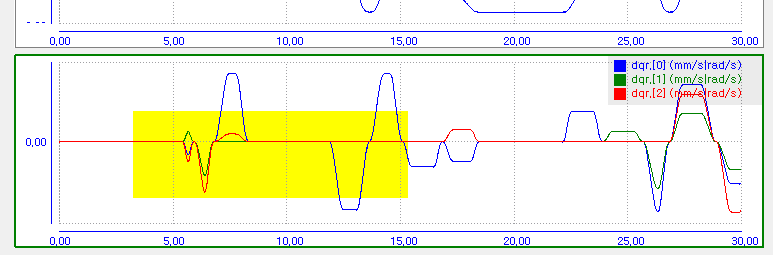
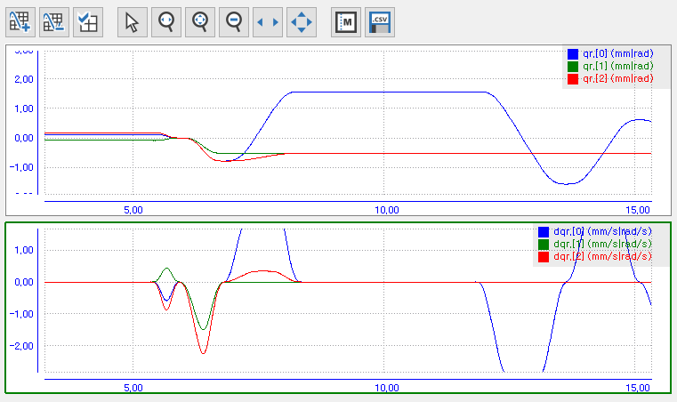

# 5.3.3 그래프의 조작

<table>
<tr>
  <th>버튼</th>
  <th>기능</th>
  <th>그래프 상에서의 조작 법</th>
</tr>
<tr>
  <td></td>
  <td>그래프를 추가하거나 선택된 그래프를제거합니다.</td>
  <td></td>
</tr>
<tr>
  <td></td>
  <td>항목(필드) 선택 창을 엽니다.</td>
  <td></td>
</tr>
<tr>
  <td></td>
  <td>normal 커서 모드를 선택합니다. (마커 이동)</td>
  <td></td>
</tr>
<tr>
  <td></td>
  <td>T(시간) 축으로 영역을 선택하여 확대합니다.</td>
  <td>마우스 좌 버튼 누른 채 드래그하여 확대할 영역 선택</td>
</tr>
<tr>
  <td></td>
  <td>Y(수직) 축, T(시간) 축으로 영역을 선택하여 확대합니다.</td>
  <td>마우스 좌 버튼 누른 채 드래그하여 확대할 영역 선택</td>
</tr>
<tr>
  <td></td>
  <td>확대하기 이전 상태로 한 단계 축소합니다.</td>
  <td></td>
</tr>
<tr>
  <td></td>
  <td>확대된 상태에서 T(시간) 축으로 이동(pan)합니다.</td>
  <td>마우스 좌 버튼 누른 채 좌우 이동</td>
</tr>
<tr>
  <td></td>
  <td>확대된 상태에서 Y(수직) 축, T(시간) 축으로 이동(pan)합니다.</td>
  <td>마우스 좌 버튼 누른 채 상하좌우 이동</td>
</tr>
<tr>
  <td></td>
  <td>마커(marker) 테이블을 열고 닫습니다. (토글)</td>
  <td></td>
</tr>
<tr>
  <td></td>
  <td>.csv 파일로 저장합니다.</td>
  <td></td>
</tr>
</table>

------------------

하단에 그래프를 하나 더 추가해 봅시다.

 버튼을 클릭하면 하단에 그래프가 하나 더 추가됩니다. 하단 그래프의 녹색 테두리는 현재 선택된 그래프임을 의미합니다. (normal 커서로 그래프 표면을 좌 클릭하여 선택할 수 있습니다.)

 버튼을 클릭한 후, dqm[0]~dqm[2]를 체크하여 1~3축의 속도 그래프를 함께 표시해봅시다.

 를 클릭한 후 그래프 일부를 드래그하여 확대해 봅니다.

 를 클릭한 후 그래프에 마우스 좌버튼으로 드래그하면 Y(값)축과 T(시간)축으로 이동(pan)할 수 있습니다. 두 개의 그래프는 T(시간)축이 항상 동기화되어 이동합니다.
