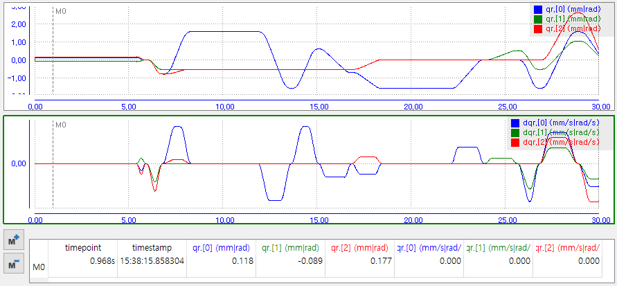
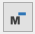

# 5.3.4 Marker

When you click  button, marker table opens. (Click once more to close.)

Clicking the  button on the left adds a marker row M0 to the table, displaying the M0 marker line (vertical dotted line) on the graph.

(Not visible if it is outside the zoomed area. Try zoom-out to find it.)
 
 

You can move the marker line by dragging it with the left mouse button. The time point at which the marker line is located and the absolute time (HH:MM:SS.usec), and the values for each field at that time are displayed in the table.

Whenever you click  button, a marker line and a table row is added. (M1, M2,…)

Whenever you click  button, the marker of selected table row is removed.
