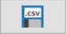
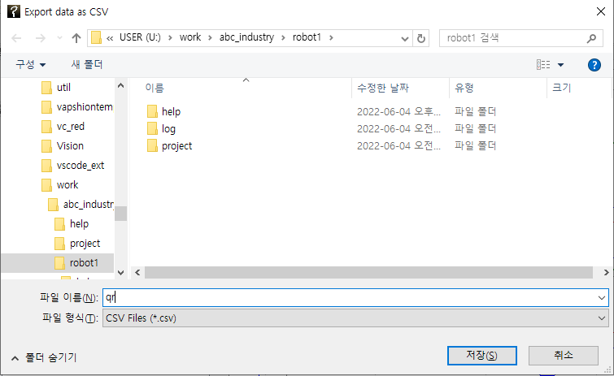
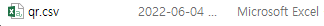
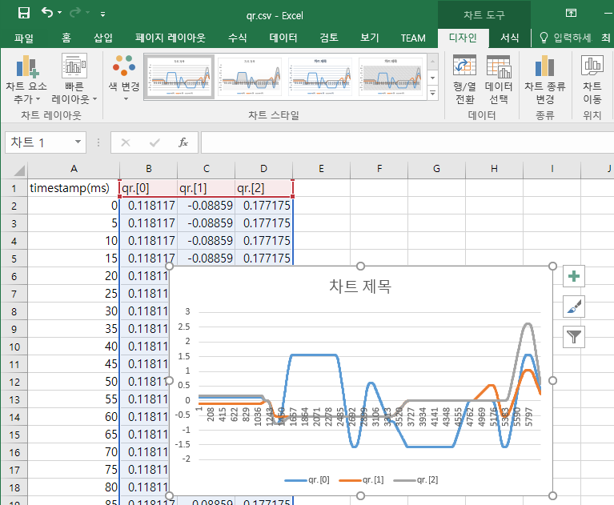

# 5.3.5 .csv 파일로 익스포트 (export)

스코프 이력 데이터를 마이크로소프트 엑셀(Excel)이나 MATLAB 등 다른 소프트웨어로 분석하려 한다면, .csv (comma-separated values) 표준 형식 파일로 저장하면 됩니다.
그래프를 선택한 후,   버튼을 클릭하면 파일 저장 대화상자가 열립니다. 경로 파일명을 지정하고 저장 버튼을 클릭합니다.

  

아래 그림은 저장된 파일을 Excel에서 열어 차트 도구로 시각화 해 본 예입니다.

