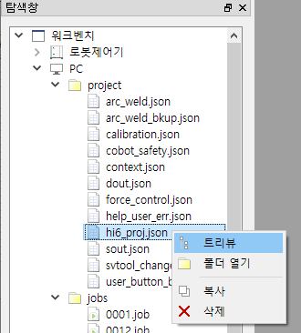
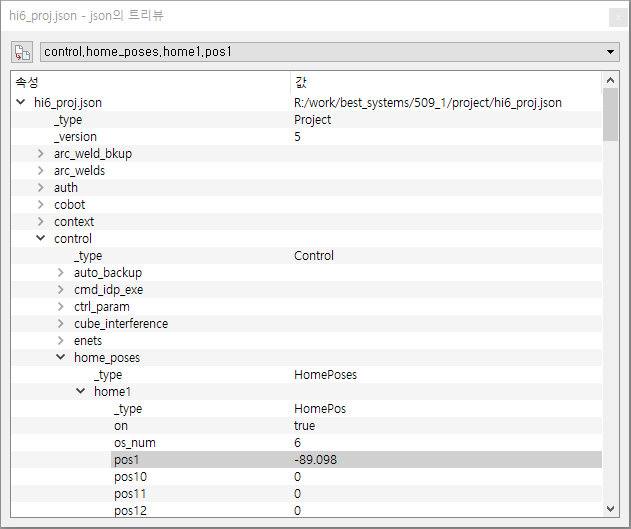
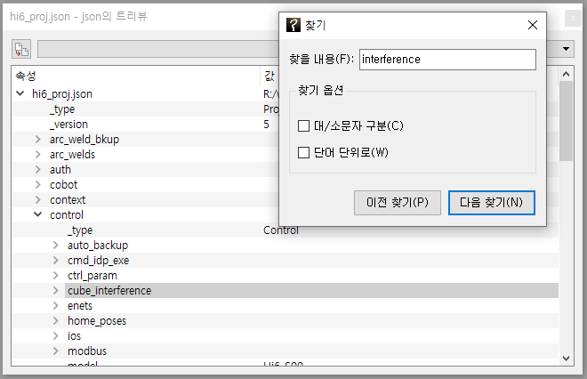

# 6.1 제어기 설정의 확인

PC로 복사된 설정 파일들의 내용을 확인할 수 있습니다.
탐색창에서 `PC/project/` 폴더 안에는, 설정을 담고 있는 .json 파일들이 있습니다. 원하는 `.json` 파일에 대해 마우스 우버튼 팝업 메뉴에서 트리뷰를 선택하면 json 트리뷰 대화상자가 열립니다.

계층적인 속성 구조와 설정값들을 확인할 수 있습니다. 값을 편집할 수는 없습니다.

속성명이나 값을 검색하고 싶다면, Ctrl+F 키로 찾기 대화상자를 열어 검색을 수행하십시오.

