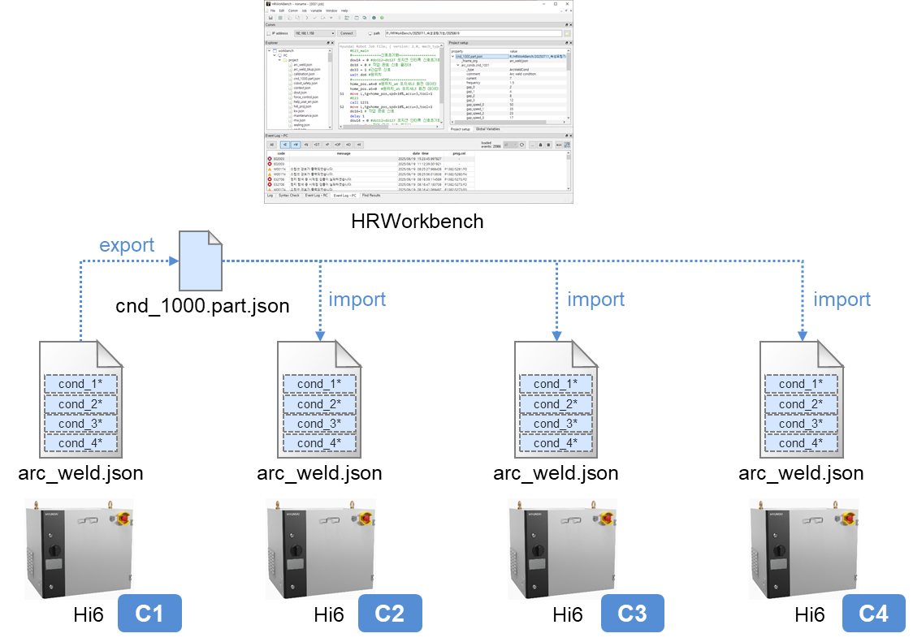

# 6.2.1. 개요

가령 A 로봇제어기의 특정 `.json` 설정파일을 B 로봇제어기로 복사하고 전원을 재투입하면, 해당 A 제어기의 해당 설정을 B 제어기에 동일하게 적용할 수 있습니다.
그러나, 만일 `.json` 파일의 일부 설정(혹은 전역변수)만을 다른 제어기에 동일하게 적용하고 싶다면, A 제어기의 `.json` 파일의 해당 부분 문자열을 복사하여, B 제어기 `.json` 파일의 같은 부분에 덮어씌우는 작업을 해야 합니다. 이러한 수작업은 손이 많이 가며, 실수로 `.json` 형식을 손상시켜 자칫 제어기의 부팅 불능이나 오동작을 유발할 수 있기 때문에 주의해야 합니다.
HRWorkbench의 설정 포팅 기능을 사용하면 비교적 쉽고 안전하게 이러한 작업을 할 수 있습니다. 가령 작업장 내에 4개의 아크용접 작업셀 C1~C4가 있는 상황을 가정해 봅시다. 작업셀 C1의 아크용접 설정과 교시를 완료한 상태에서, 용접조건 `cnd_1000` 이상 `cnd_1100` 미만을 C2~C4에 수평 전개해야 한다면, C1의 해당 설정을 익스포트(export)하여 C2~C4에 각각 임포트(import)하면 됩니다. 이를 수행하는 절차를 예시로 포팅 기능을 설명하겠습니다.

