# 6.2.2  익스포트와 임포트

PC에 C1~C4 제어기 각각의 백업 폴더가 있고, 각 제어기가 전체 백업된 상황에서 실습을 시작하겠습니다.

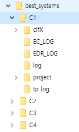

먼저, C1 제어기의 PC경로를 선택합니다.
 
 

`PC/project/arc_weld.json` 파일에 대해 트리뷰를 열고, cnd_1001 ~ cnd_1092를 선택합니다. (SHIFT, Ctrl키 조합으로 여러 개의 항목을 선택할 수 있습니다.)

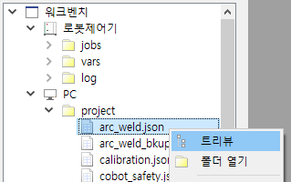
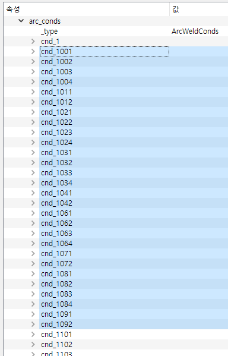

선택 항목에 대해 마우스 우클릭으로 팝업 메뉴를 열어 익스포트를 선택합니다.
 
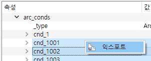

적당한 json 파일명을 입력하고 저장을 클릭합니다. (부분 json 파일은 `.part.json` 확장자를 붙이도록 합시다.)
 
 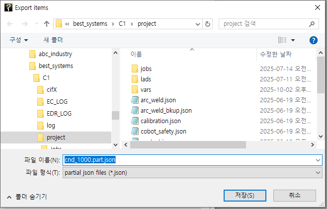

탐색창의 `PC/project/`에 `cnd_1000.part.json` 파일이 저장된 것을 볼 수 있습니다. (이 파일의 내용도 트리뷰로 열어 볼 수 있습니다.) 팝업 메뉴로 생성된 파일을 복사합니다.

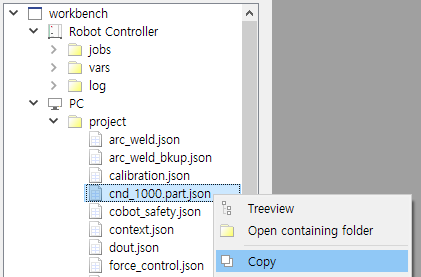

C2 제어기의 PC경로를 선택하고, `PC/project/` 에 붙여넣기를 수행합니다.
(HRWorkBench 대신, 윈도우 탐색기 등 다른 수단으로 복사해도 됩니다.)
 
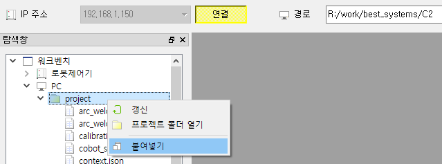

붙여넣어진 `cnd_1000.part.json` 파일의 트리뷰를 엽니다.

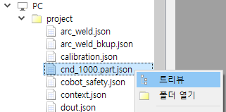

트리뷰의 내용을 확인하고 최상위 노드인 `cnd_1000.part.json`에 팝업 메뉴를 열어 `임포트 -> arc_weld.json` 을 실행합니다.
 
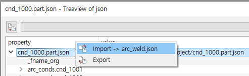
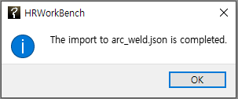

C3과 C4에 대해서도 동일하게 수행합니다.
(각 폴더의 `cnd_1000.part.json`은 임포트 후 삭제해도 무방합니다.)

참고로, 전역변수도 설정과 동일한 방법으로 익스포트, 임포트를 할 수 있습니다.

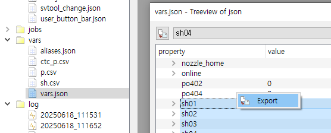
