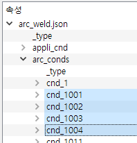
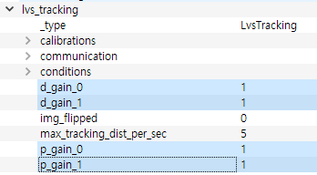
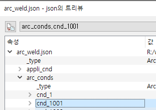
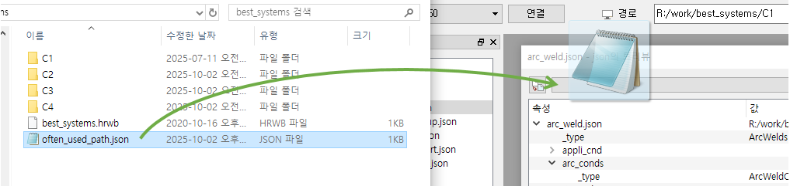
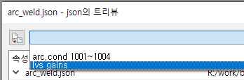
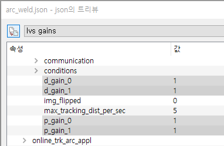

# 6.2.3 자주 사용하는 경로들의 익스포트

여러 경로들의 설정을 익스포트하는 조작을 반복적으로 자주 수행할 경우에는, 매번 해당 경로들을 선택하는 것이 번거로울 수 있습니다.

자주 사용하는 경로들의 목록을 미리 파일로 작성해놓고, 이를 트리뷰에 적용하여 선택을 쉽고 빠르게 할 수 있습니다.

간단한 예제로서, `arc_weld.json`의 `arc_conds/` 이하 4개의 항목, `lvs_tracking/` 이하 4개의 항목을 이 방법으로 선택해 보겠습니다.




텍스트 편집기를 이용하여 PC의 임의의 폴더에 아래와 같은 .json 파일을 작성합니다. 파일 형식은 json 문법(https://www.json.org/json-ko.html)을 준수해야 하지만, 파일명은 중요하진 않습니다. 

- often_used_path.json
	```json
	{
		"lvs gains": [
			"lvs_tracking.d_gain_0",
			"lvs_tracking.d_gain_1",
			"lvs_tracking.p_gain_0",
			"lvs_tracking.p_gain_1"
		],
		"arc.cond 1001~1004" : [
			"arc_conds.cnd_1001",
			"arc_conds.cnd_1002",
			"arc_conds.cnd_1003",
			"arc_conds.cnd_1004"
		]
	}
	```

위 예를 보면 `lvs gains`와 `arc.cond 1001~1004`는 콤보박스에 열거할 그룹명입니다. 각 그룹의 값은 경로 문자열 배열, 즉 `[ ]` 안에 열거된 형태로 작성해야 합니다.

(특정 항목의 경로는 아래 그림과 같이 항목을 선택한 상태에서 트리뷰 대화상자 상단의 콤보박스를 보면 확인할 수 있습니다.)



윈도우 탐색기에서 작성된 `.json` 파일을 드래그하여 트리뷰 상단 콤보박스 위에 드롭합니다.
 


콤보박스를 열어보면, 작성한 그룹명들이 보입니다. 가령 `lvs gains`를 선택하면 해당하는 경로들이 자동으로 선택됩니다.
 


좌상단의  (익스포트) 버튼을 클릭하면 선택한 그룹의 항목들이 익스포트 됩니다.


